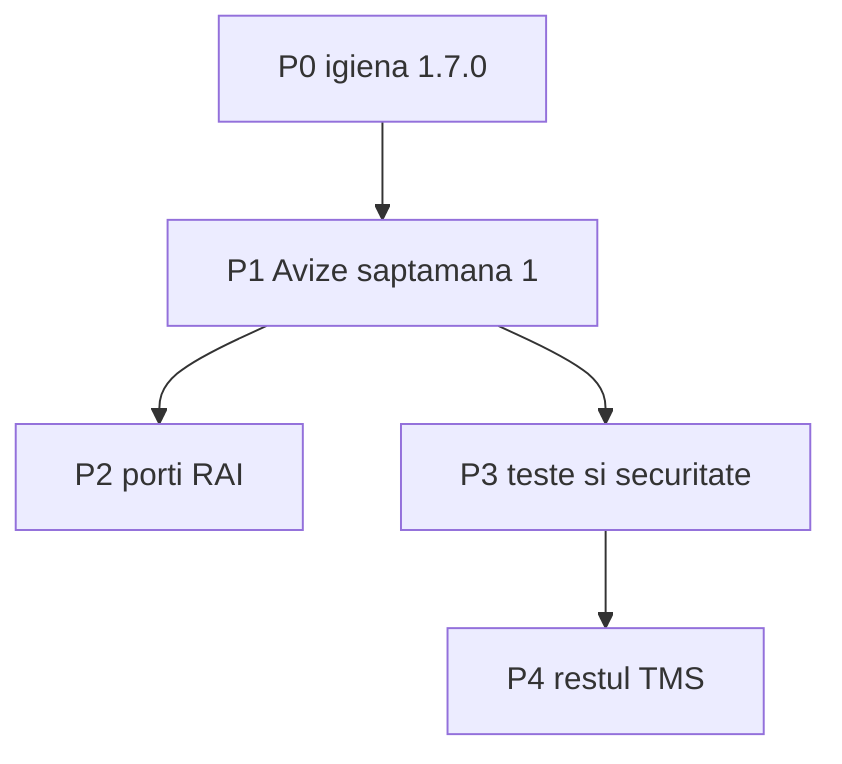

# Transitix — ce mai merită îmbunătățit (după 1.7.0)

**Branch:** `RAI-spedition` (fără feature branch).  
**Bază:** Avize A–E sunt în working tree, migrarea locală e făcută, **nu e commit**.  
**Principiu:** întâi facem anexa RAI folosibilă în săptămâna de birou; GPS live, Planning AI, e-Factura ANAF **nu** se amestecă aici.



---

## Verdict scurt

1.7.0 e **funcțional, nu lustruit**. Cel mai mare risc nu e un feature nou, ci: listă/email/ciornă fragile la volum, preview JWT în query, upload-uri neizolate pe firmă, și zero teste pe rutele HTTP Avize. Restul TMS (GPS / Planning / ANAF) rămâne demo etichetat — îl lăsăm așa până RAI e stabil.

**Primul lucru după acest plan:** P0 (commit) apoi P1.1–P1.6 (buguri de folosire, nu features).

---

## P0 — Igienă 1.7.0 (înainte de orice feature) — S

Fără asta, P1 se amestecă cu un working tree uriaș.

- [ ] **Commit pe `RAI-spedition`** cu `feat: avize A-E` **și** `[skip version]` (versiunea e deja 1.7.0 în ambele `package.json`). Nu include `server/.env`, chei, PDF-uri client.
- [ ] **Smoke manual** pe `/avize` după refresh: filtru săptămână, Editează + preview, TPO duplicat, Unește, Rapoarte, ciornă factură. Checklist scurt în `docs/changes/1.7.0-avize-increments.md`.
- [ ] **Port DB:** README zice host **5434**; `.env` local e **5432**. Documentează realitatea (sau aliniază compose). Fișiere: `README.md`, `server/.env.example`.
- [ ] **Restart API** dacă lista Avize crapă pe coloane noi (`extraction_source`, `ruta_display`).

**Gata P0 când:** 1.7.0 e pe branch, pagina Avize se deschide, Unește descarcă XLSX.

---

## P1 — Avize, săptămâna 1 (buguri + UX) — M

Pagina: [`src/pages/AvizeReports.jsx`](src/pages/AvizeReports.jsx) (~1150 linii). API: [`server/src/routes/avize.js`](server/src/routes/avize.js).

### P1.1 Căutare fără bombardament

- [ ] Debounce 300ms pe `q` (acum `GET /api/avize` la fiecare tastă).
- [ ] Escape `%` / `_` în ILIKE ([`server/src/lib/avizQuery.js`](server/src/lib/avizQuery.js)).
- [ ] Indicator „se încarcă” la schimbarea filtrelor, fără full-page spinner.

### P1.2 Selecție vs filtru

- [ ] La schimbarea filtrelor, curăță `selected` (sau păstrează doar id-urile încă vizibile).
- [ ] **Confirmă selectate** să ignore rândurile deja `confirmed` și să zică câte s-au actualizat.

### P1.3 Email / Zip / Unește

- [ ] Email stub: nu mai apela de două ori `buildAnnexBuffer` (acum `/email` + `exportXlsx` din UI). Răspuns stub cu fișier sau un singur download.
- [ ] Zip: nume fișiere unice dacă două avize au același `original_filename` (`originale/{tpo}-{basename}`).
- [ ] Cap la `aviz_ids` (ex. 200) pe export / zip / email / bulk-confirm / draft-invoice.
- [ ] Toast dacă zip-ul omite originale lipsă de pe disk.

### P1.4 Editează

- [ ] Preview PDF: `iframe` + JWT în query e OK pentru ``, dar token-ul ajunge în istoricul browserului. Preferă blob URL (`fetch` + `Authorization`) pentru preview.
- [ ] Câmpuri low-confidence: legendă scurtă („verifică” = parser nesigur, nu eroare).
- [ ] `trip_id`: dacă sugestiile sunt goale, tot poți salva fără cursă (deja); adaugă text „Nicio cursă pe auto+zi”.
- [ ] Șterge pe șablonul blocat **Anexa Factura RAI**: ascunde butonul (API deja 400, UI încă arată Șterge).

### P1.5 Ciornă factură

- [ ] UI: alegere regulă **valoare TPO** vs **km × tarif** (acum e hardcodat `tpo`).
- [ ] După succes: link către `/finance` + numărul ciornei.
- [ ] `client_name`: din cursă (`consignee_name`) dacă `trip_id` e setat; altfel câmp în dialog, nu „Client avize”.
- [ ] Număr factură: fără race pe `COUNT(*)` (sequence sau `MAX` în tranzacție). Fișier: `POST /api/avize/draft-invoice`.

### P1.6 Rapoarte

- [ ] Empty state pe tabele goale (nu tabel gol fără text).
- [ ] `aviz_export_log`: cine a exportat (`user_id` / email), nu doar `created_at`.
- [ ] Rapoarte nu trebuie să aibă selector de șablon Anexa (deja nu are) — păstrează constrângerea.

### P1.7 Fișier pagină

- [ ] Sparge `AvizeReports.jsx` în componente (toolbar, listă, edit modal, rapoarte). Fără schimbare de comportament.

**Gata P1 când:** un dispecer filtrează o săptămână, confirmă 20 rânduri, unește, zip, ciornă, fără dublu-export și fără preview care scurge JWT în URL.

---

## P2 — Porți RAI (doar după răspuns) — S–M

Nu ghici. Impliciturile actuale rămân până bifează ei.

| # | Întrebare | Acum | Dacă RAI zice altfel |
|---|-----------|------|----------------------|
| R1 | TPO duplicat | avertizează, salvează | UNIQUE sau blochează save |
| R2 | Rută în Excel | Client → Livrare; `ruta_display` doar UI | pune alias în coloana Ruta |
| R3 | Sumă factură | omul alege TPO sau km×tarif | o singură regulă, ascunde cealaltă |
| R4 | OCR poză go-live | nu e obligatoriu | forțează Vision + runbook VM |
| R5 | Split un PDF → 2 rânduri | **skip** | abia atunci B6 |

- [ ] Răspunsuri în [`docs/avize-planning-checklist.md`](docs/avize-planning-checklist.md) (tabelul R1–R5).
- [ ] Parser: 2+ PDF-uri reale locale cu `Blvd`/`Bld` (nu git) — verificare manuală A1.
- [ ] Layout-uri non-Baumit: **minimum 10 mostre locale** înainte de regex nou (C5). Fără ghicit.

**Gata P2 când:** R1–R3 sunt confirmate sau explicit „rămâne implicitul”.

---

## P3 — Teste, CI, securitate — M

CI actual ([`.github/workflows/ci.yml`](.github/workflows/ci.yml)): lint + unit + build frontend. **Fără Postgres, fără rute HTTP.**

### P3.1 Teste Avize

- [ ] Teste pe `buildAvizListQuery` pentru `%` escape și limit 200 (deja parțial).
- [ ] Teste rute (supertest sau helper intern): list filters, duplicate_tpo pe PUT, lock Anexa RAI, bulk-confirm, draft-invoice doar `confirmed`.
- [ ] Test merge `ruta_display` (deja în `concurrency.test.js`) + extract nu șterge coloana (omise din UPDATE — păstrează).

### P3.2 Upload isolation (securitate reală)

[`GET /uploads/:filename`](server/src/index.js) cere JWT, **nu** `company_id`. Cine ghicește/reține UUID-ul fișierului din altă firmă îl citește.

- [ ] Rezolvare: mapare `uploads` → `company_id` (coloană pe `aviz_documents` / `trip_documents` deja au `file_url`) și 404 dacă fișierul nu e al firmei.
- [ ] Nu loga `access_token` query (P1.4 reduce suprafața).

### P3.3 Rate limit / mărime

- [ ] Rate limit pe `POST /api/avize/extract` și upload (Vision cost).
- [ ] `express.json` 1mb e OK pentru JSON; upload-ul e multipart separat — verifică limita multer.

### P3.4 CI

- [ ] Job opțional cu Postgres service + `npm run db:migrate` + un smoke HTTP (health + login + GET `/api/avize`). Nu e blocker pentru RAI dacă P3.1 e acoperit unitar.

**Gata P3 când:** un test rupe lock-ul Anexa RAI sau list filter; upload cross-tenant e 404.

---

## P4 — Restul produsului (după Avize stabil ~1 săptămână) — L

Nu intra aici în paralel cu P1. Etichetele de stub din README rămân adevărate.

### P4.1 Financiar

- [ ] `InvoiceForm` generează număr cu `Math.random` — aliniere cu sequence-ul din ciorna avize.
- [ ] e-Factura rămâne simulare până integrare ANAF (explicit **nu** în acest plan de execuție).
- [ ] Trimitere factură: același pattern Resend ca anexa.

### P4.2 Curse + Avize

- [ ] Pe `TripDetail`: listă opțională avize cu `trip_id` (doar dacă e trivial; altfel ticket separat).
- [ ] Dashboard: nu aglomera cu avize până RAI cere.

### P4.3 Flotă / Documente / App șofer

- [ ] Load errors: unele pagini (`Vehicles`, `Clients`, `Documents`) fac `console.error` fără toast la eșec listă.
- [ ] App șofer: smoke alocare cursă → status `in_tranzit` (regresie 1.3.1).
- [ ] Expirări documente: verifică pragurile din Setări pe date reale.

### P4.4 Demo-uri care rămân demo

- [ ] Tracking GPS: copy în UI „nu e GPS live”.
- [ ] Planning AI: copy „sugestii stub”.
- Nu construi integrator real aici.

**Gata P4 când:** Financiar nu mai are numere random; GPS/Planning nu mint că sunt live.

---

## P5 — Explicit mai târziu / nu începe

- GPS tracker real (device/API).
- Optimizer rute / Planning AI real.
- e-Factura ANAF.
- Mișcări depozit din linii de aviz.
- Split PDF (B6) fără R5.
- Parser generic non-Baumit fără 10 mostre.
- Tab Rapoarte care exportă alt XLSX peste Anexa RAI.

---

## Ordine de execuție (când zici „hai”)

```
P0 commit + smoke
 → P1.1 căutare
 → P1.2 selecție
 → P1.3 email/zip cap
 → P1.4 preview fără JWT în URL + ascunde Șterge RAI
 → P1.5 ciornă factură
 → P1.6 rapoarte cine/empty
 → P1.7 split pagină (opțional, după ce UI e stabil)
 → P3.1 teste rute + P3.2 upload tenant
 → P2 doar cu răspunsuri RAI
 → P4 restul TMS
```

La fiecare increment închis: teste, `CHANGELOG.md` `[Unreleased]`, `docs/changes/`, versiuni aliniate (patch până iese un feature vizibil nou → minor 1.8).

---

## Fișiere de atins cel mai des

| Zonă | Fișiere |
|------|---------|
| Listă / UI | `src/pages/AvizeReports.jsx`, `src/api/client.js`, `src/lib/avizOps.js` |
| API | `server/src/routes/avize.js`, `server/src/lib/avizQuery.js` |
| Preview | `src/lib/uploadUrl.js`, `server/src/index.js` (uploads) |
| Factură | `server/src/routes/avize.js` draft-invoice, `src/components/InvoiceForm.jsx` |
| Schema | `server/src/migrate.js` (`aviz_export_log.user_id`) |
| Lock șablon | `server/src/lib/avizQuery.js` `isLockedRaiTemplate` |

**Nu se atinge:** regex TPO/auto din `avizOcr.js` fără test de regresie; `avizVision.js` rămâne modul separat.
