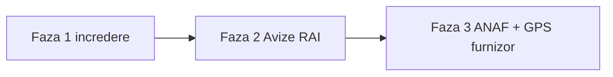

# Transitix vs piața TMS din România — drumul către producție

**Branch:** `RAI-spedition`.  
**Dată:** 2026-08-19.  
**Principiu:** nu simulăm ANAF sau GPS live. Câștigăm întâi încrederea, apoi Avizele RAI, apoi conformitatea legală.

Nu putem trece peste Routena / QuickCargo / Atrux pe e-Factura + UIT + telematică într-un sprint. Putem fi **singurul TMS din RO** cu flux Avize → Anexa Factura RAI de birou, și un produs care nu minte.

---

## Piața (ce vând ei, august 2026)

| Competitor | Ce vând ca „complet” | Unde Transitix e în urmă | Unde Transitix e înainte |
|------------|----------------------|---------------------------|---------------------------|
| **Routena** | e-Factura SPV, GPS Acron/CargoTrack/iTrack, cost/km, app șofer | SPV, GPS live, marjă matură | OCR avize + anexă XLSX |
| **QuickCargo** | e-Factura + e-Transport, SAGA, DKV/Shell/Eurowag, 6+ GPS | UIT API, carduri combustibil, import facturi transportatori | Multi-tenant propriu, portal destinatar |
| **Atrux** | e-CMR, e-Transport UIT, e-Factura, GPS, rutare | UIT API, e-CMR legal | Anexă RAI, depozit simplu |
| **Leelo / innoTMS / Trax / IMFS** | Mix dispecerat + facturare RO | Integrări fiscale | UX birou + Avize |

Surse: [routena.com](https://routena.com/), [quickcargo.ro](https://quickcargo.ro/tms), [atrux.ro](https://atrux.ro/).

**Obligații RO pe care un TMS „complet” trebuie să le acopere:**

1. **e-Factura** — XML către SPV ANAF, nu un flag în Postgres.  
2. **RO e-Transport** — cod UIT (generat max 3 zile înainte de plecare) + GPS către CNIF pe durata transportului monitorizat.  
3. **Documente** — CMR / aviz la control, corelate cu UIT.  
4. **Cost real** — combustibil, taxe, tarif, marjă pe cursă.

---

## Verdict onest pe Transitix (înainte de Faza 1)

| Modul | Stare reală | Minciuna de evitat |
|-------|-------------|-------------------|
| Avize / Rapoarte | Producție (OCR + anexă) | — |
| Curse / flotă / șoferi | Producție MVP | — |
| Confirmare client | Producție (token) | Email poate fi stub |
| Financiar | Ciorne locale | Butonul «e-Factura» nu e SPV |
| GPS | Simulare București | «Actualizează poziții» |
| Planning AI | Sugestii stub | «Inteligență artificială» fără disclaimer |
| Depozit | Stoc simplu | Nu e WMS |
| Upload-uri | JWT, **fără** `company_id` | Un JWT din firma A putea citi fișierul B |

---

## Faza 1 — încredere (acest increment)

- [x] Banner / etichetă **demo** pe GPS, Planning AI, e-Factura  
- [x] Upload-uri prefixate `c-{company_id}-…`; GET `/uploads` refuză alt tenant  
- [x] Număr factură din contor per serie (tranzacție), nu `Math.random` / `COUNT(*)`  
- [x] Câmp **UIT** + venit/cost pe cursă (fără API ANAF)  
- [x] CUI expeditor/destinatar în formularul de cursă  
- [x] `GET /api/health` raportează capabilități (`efactura`, `gps`, `vision`, `email`)  
- [x] Limită pe `POST /api/avize/extract` (Vision costă)

**Gata Faza 1 când:** un tester deschide GPS și citește „simulare”; un JWT din firma A primește 404 pe upload-ul firmei B; două facturi TRX consecutive nu sar numere.

---

## Faza 2 — Avize (săptămânile următoare)

Rămâne paleta cu care un birou alege Transitix în loc de un TMS generic:

- P1 rămas: `user_id` pe `aviz_export_log`, split `AvizeReports.jsx`, teste HTTP  
- Porți RAI (TPO duplicat, rută Excel, regulă sumă)  
- Vision pe VM (`docs/ops-google-vision.md`)

Vezi [`docs/next-improvements.plan.md`](next-improvements.plan.md).

---

## Faza 3 — să fim „TMS RO complet” (luni, cu parteneri)

Nu se fakesuie. Fiecare e un proiect separat:

| # | Lucrare | Dependență externă |
|---|---------|-------------------|
| 3.1 | e-Factura UBL + certificat SPV | ANAF, contabil, mediu test |
| 3.2 | e-Transport: declarare + UIT înapoi pe cursă | ANAF e-Transport API |
| 3.3 | GPS: webhook CargoTrack sau Acron → `gps_logs` | Contract furnizor; harta rămâne Leaflet |
| 3.4 | Import costuri card (CSV DKV/Shell) | Fișier, nu 5 API-uri odată |
| 3.5 | Export SAGA / contabil | Mapping plan de conturi |

---

## Ce nu facem

- Nu marcăm `efactura_status = sent` ca și cum ANAF ar fi primit XML.  
- Nu generăm UIT fictive.  
- Nu scriem un tracker GPS propriu.  
- Nu amestecăm Avizele RAI cu SPV până Faza 1 e în producție.
